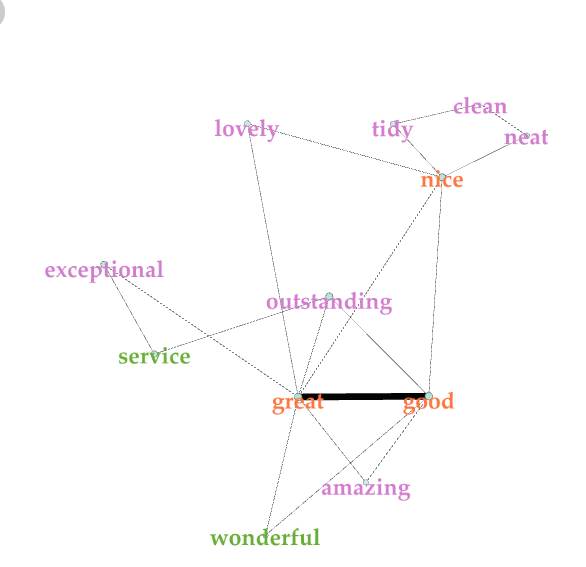
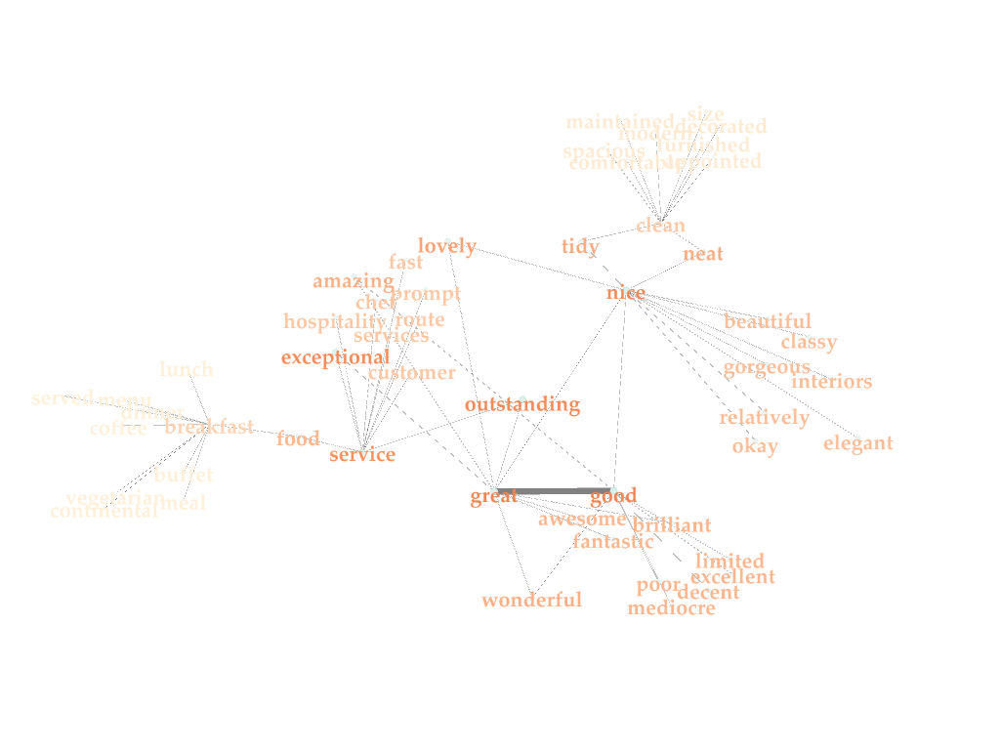
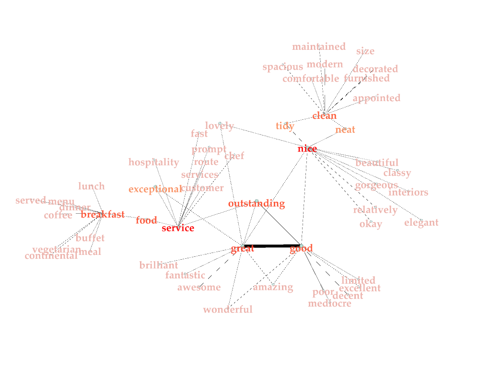
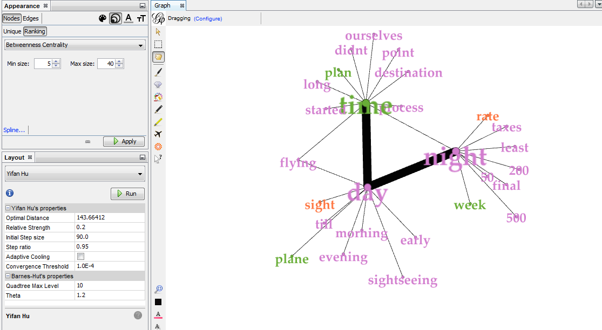

# Closeness Analysis with Hotel reviews

Date: **19.05. (Due: 21.05.)**

Name: **Balaji Subramani**

Session: **[Text Graph](https://textvis.repke.eu/index.html)**

Code: on **[GitHub](https://github.com/balag752/Text-Visualization-Blog-5-Text-Graph)** 

## Objective

This blog is focused to visualize the Text Graph features. For the text graph, we need word embedding and Topic modeling functionalities. So we have used LDA & Word2Vec method. Here also, we experimented text graph functionality with Trip adviser dataset.

## Data Filtering

Due to the huge size of the volume, we have restricted and filtered low rated (<2) & high rated (4.8) reviews, for topic modelling analysis. Also limited the text graph only for New Delhi city reivews.

We have used the same last blog topic modelling approch for splitting data into 4 topics.

- Topic 0 : Sight seeing

- Topic 1 : Hostel

- Topic 2 : Food

- Topic 3 : Staff Service

## Text Graph Data Set

#### Node :

From the overall reviews, we are taking most common words and finding similiar words using LDA. Totally, we have 313 words for nodes. Each Node has below attributes:

- ID - word

- Label - word

- Topic - Predicted topic name for given word (Word2Vec)

#### Edges :

Edges are primiliary designed based on word similiarity. Edge source & target nodes are must be in Node dataset

- Source - word

- Target -  Similiar words

- Weight - Probablity between similiarity.

All edges are considered as a indirect edge in our analysis.

# Text Graph

We have used gephi tool for text graph visualization. Node and Edge data sets are given as the input for text visulization.

### Dirty Text Graph

We plotted text graph based on node and edge dataset and distinguesed node text based on topic name.

[Text Graph]

Text size is based on the degree centrality. This graph is not very informative. There are lot of unconnected nodes. As well as we are able to distinguish as 4 clusters in text graph.

### Elminating non degree nodes

Intially, we are filtering out the non connected nodes and below is the filtered graph. Now we are able to find the over all idea about how each node is connected.

 

  [Text Graph with all connected nodes] 

## Core graphs

K core helps to find the coreness in graph. For K=1, it removes all unconnected nodes , result is similiar to the above image (Non Degree nodes).

[Text Graph with all k coreness]

### Closeness vs Between centrality

We have forced part of the cluseter from better comparision of centralities. We have showed the dark red color text as **closeness** of the nodes.

[Closeness centerality]

Furthermore, below is the **Between centerality** text graph.  We are able to similiar results but metrics are varies.

## Zooming the each cluseter in Text Graph

### Time cluster

We have used the Between centrality for text size.  We can deep connection with the day, time and night words. As well all 3 are interconnnected. flying is again connecting with time and day words.

##### 

### Location cluster

Here Location and hotel is major word and each word have the different similiarity and property is in both and acting as the strong one in between centrality.

 

## Hotel feedback cluster

Most of the makor words are realted to food, positive feedback. Here also, between centrality shows a better results in showing major nodes and connection.

### Conclusion

 From the text graph, we are able to structure the topic modelling and word embedding in better way. Also it depicts the better intutive results.
