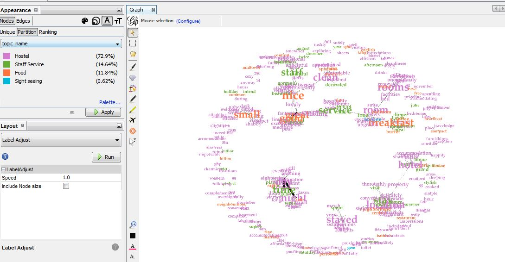

# Closeness Analysis with Hotel reviews

Name: **Balaji Subramani**
Code: on **[GitHub](https://github.com/balag752/Text-Visualization-Blog-5-Text-Graph)** 

## Objective

This blog is focused to visualize the Text Graph features. For the text graph, we need word embedding and Topic modeling functionalities. So we have used LDA & Word2Vec method. Here also, we experimented text graph functionality with Trip adviser dataset.

## Data Filtering

Due to the huge size of the volume, we have restricted and filtered low rated (<2) & high rated (4.8) reviews, for topic modeling analysis. Also limited the text graph only for New Delhi city reviews.

We have used the same last blog topic modeling approach for splitting data into 4 topics.

- Topic 0: Sightseeing
- Topic 1: Hostel
- Topic 2: Food
- Topic 3: Staff Service

## Text Graph Data Set

#### Node :

From the overall reviews, we are taking the most common words and finding similar words using LDA. Totally, we have 313 words for nodes. Each Node has the below attributes:

- ID - word
- Label - word
- Topic - Predicted topic name for the given word (Word2Vec)

#### Edges :

Edges are primarily designed based on words similarity. Edge source & target nodes are must be in Node dataset

- Source - word
- Target -  Similiar words
- Weight - Probability of the word similarity.

All edges are considered as an indirect edge in our analysis.

# Text Graph

We have used the **gephi tool** for text graph visualization. Node and Edge data sets are given as the input for text visualization.

### Dirty Text Graph

We plotted text graph based on node and edge dataset and categorized node text based on the topic names.

[Text Graph]

Text size is based on the degree centrality. This graph is not very informative. There are a lot of unconnected nodes. As well as we are able to distinguish as 4 clusters in text graph.

### Eliminating nondegree nodes

Initially, we are filtering out the non-connected nodes and below is the filtered graph. Now we are able to find the overall idea about how each node is connected.

  [Text Graph with all connected nodes] 

## Core graphs

K core helps to find the coreness in the graph. For K=1, it removes all unconnected nodes and the result is similar to the above image (Non-connected nodes).

[Text Graph with all k coreness]

### Closeness vs Between centrality

We have forced part of the cluster from a better comparison of centralities. We have shown the dark red color text as **closeness** of the nodes.

[Closeness centerality]

Furthermore, below is the **Between centrality** text graph.  We are able to similar results but metrics are varied.

[Between centerality]

## Zooming each cluster in Text Graph

### Time cluster

Here, we have used the **Between centrality** for text size.  We can connect with the day, time and night words. As well all 3 words are interconnected. *flying* is again connecting with time and day words.

[Text Graph - Time Cluster]

### Location cluster

Here **Location** and hotel is a major word and each word have different similarity and **property** is in both and acting as the strong one in between centrality.

[Text Graph - Location Cluster]

## Hotel feedback cluster

Most of the major words are related to **food** as well as most words are having a positive word. Here also, between centrality shows better results in showing a major connection.

[Text Graph - Food Cluster]

### Conclusion

 From the text graph, we are able to structure the topic modeling and word embedding in a better way. Also, it depicts better intuitive results.
